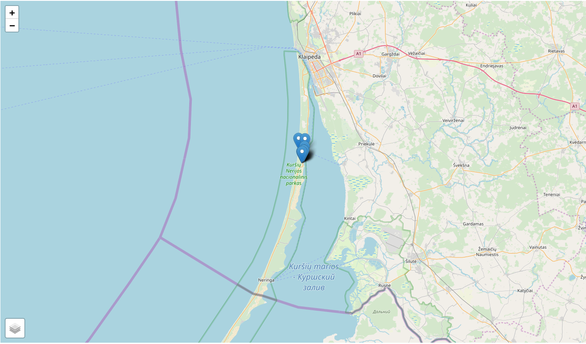
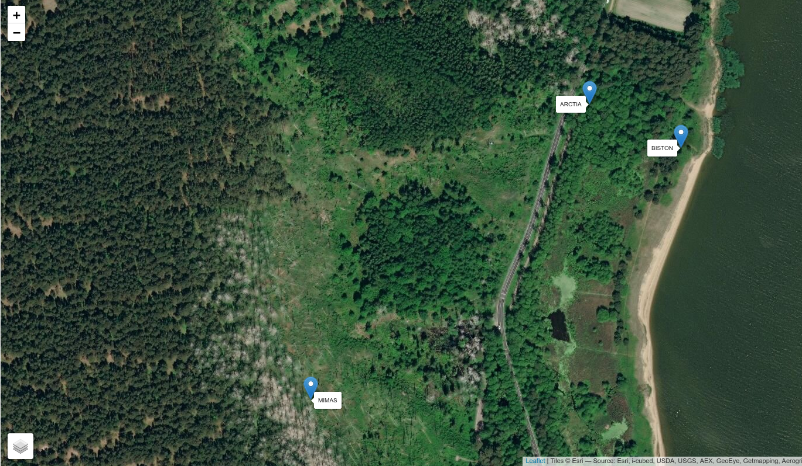
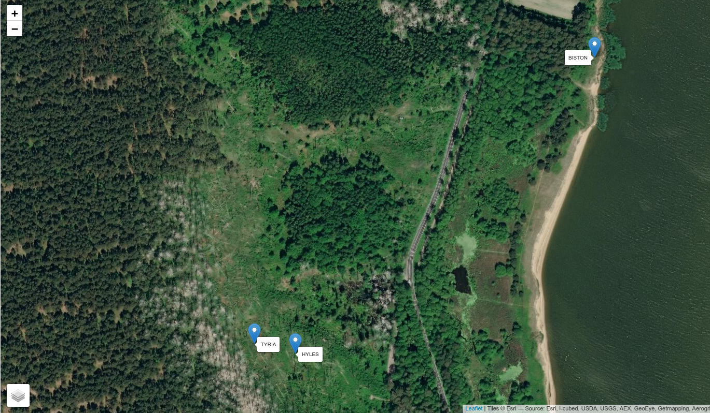

# BATSAMPLES  

Here I storage some recordings of bat ultra-sounds performed in Lithuania, on the Curonian spit.  

* All samples have been recorded with Audiomoth devices packed in a waterproofed plastic box.  
* The sampling rate is 192 kHz. Each file is also provided time-expanded in the sub-folder Exp10 in order to be directly played 10 times slower, but therefore **mind the X and Y scales** which are artificially modified!  

**FEEL FREE TO EDIT AND ADD COMMENTS TO THIS FILE**  

**Localisation map**   
  

## First session (May 2019)  

Files:  

### 20190501_Juodkranté/ARCTIA   
* 20190502_193420: EPTNIL, 2 feeding buzzes  

### 20190501_Juodkranté/BISTON   
* 20190501_191400: EPTNIL + NYCNOC  
* 20190501_213340: EPTNIL, 2 individuals with trill or feeding buzz?  
* 20190502_000600: EPTNIL + feeding buzz  

### 20190501_Juodkranté/MIMAS
(* 20190501_193000: EPTNIL, 2 individuals: not added yet)

**Localisation of the detectors**   

  

## Second session (September-October 2019)  

Files:  

### 20190927_Juodkranté/BISTON
* 20190927_172500: EPTNIL with feeding buzz (+ PIPNAT)  

### 20190927_Juodkranté/HYLES
* 20190929_165240: EPTNIL with trill or feeding buzz (+ PIPNAT)  

### 20190927_Juodkranté/TYRIA
* 20190927_165820: EPTNIL  
* 20190928_165700: EPTNIL  

* 20190927_212000 NYCLEI !?  

**Localisation of the detectors**   

  

